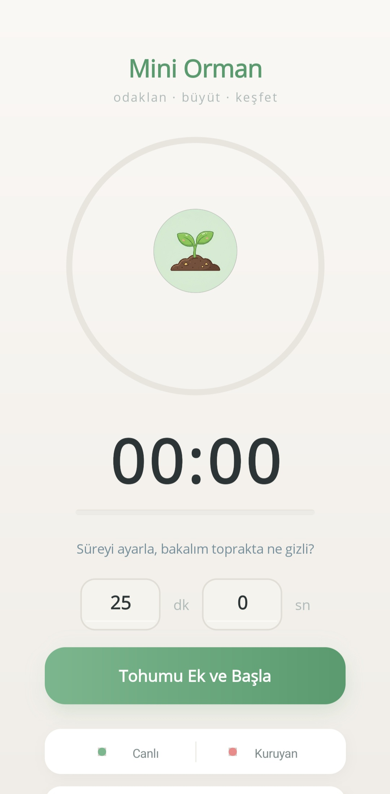
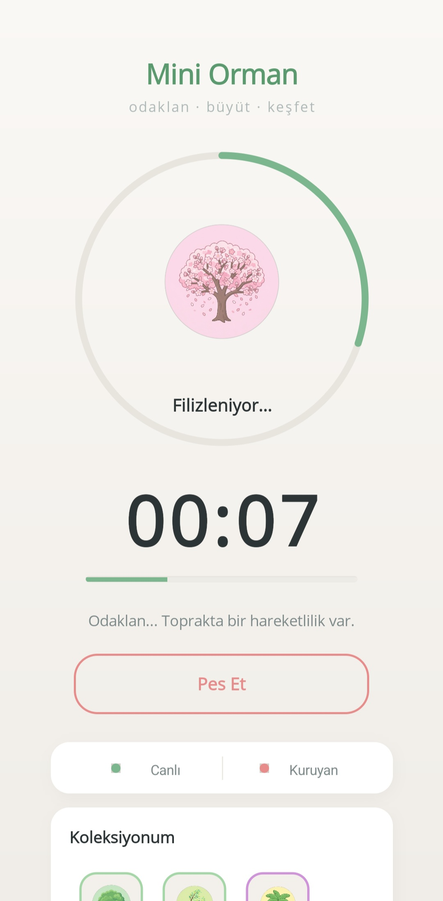
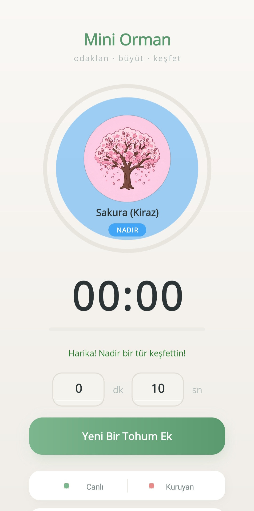
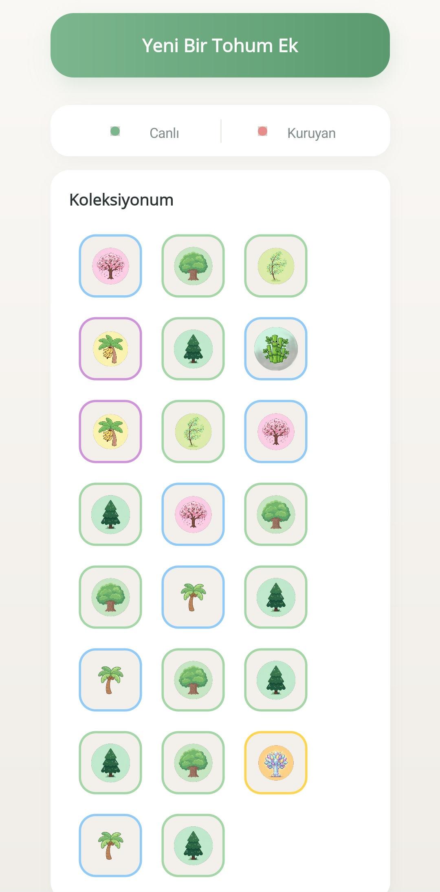
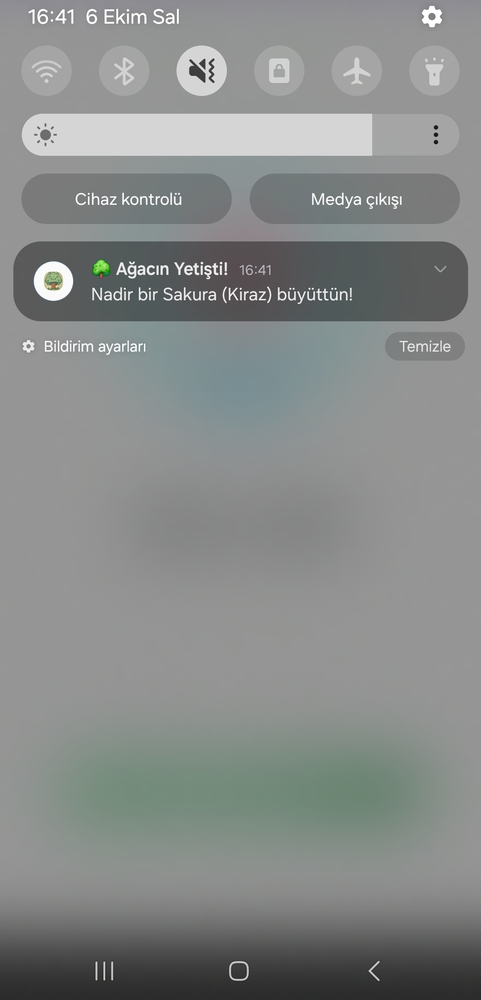
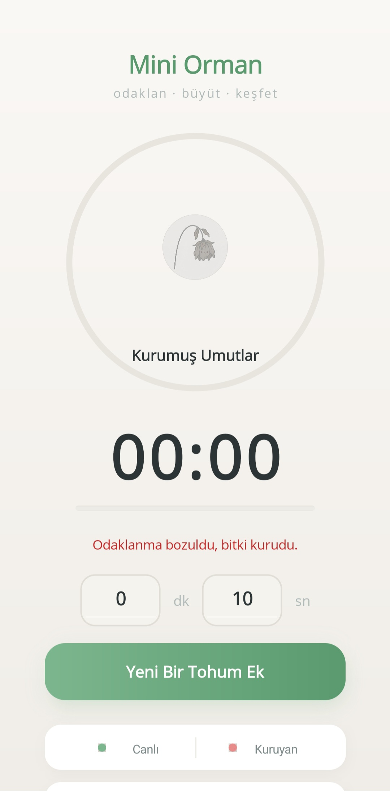

# 🌲 Mini Orman (Mini Forest)


A privacy-focused focus timer application. 

This repository showcases the evolution of the **Mini Orman** project from a simple HTML/JS web page (v1) to a compiled mobile application built with .NET MAUI (v2).

## 🚀 The Evolution (v1 to v2)

*   **v1-HTML-Version:** The initial concept. A basic, browser-based timer built with standard HTML, CSS, and JavaScript.
*   **v2-MAUI-Mobile:** The current mobile application. Built using C# and XAML on the .NET 8 MAUI framework. It features native UI components, local storage, and background notifications.

## ✨ Features (v2)

*   **100% Offline & Privacy First:** No backend, no databases, no internet permissions (`INTERNET` permission explicitly removed). All user focus statistics and collected trees are stored securely in the device's sandboxed local storage (`FileSystem.AppDataDirectory`).
*   **Gamified Focus:** Set a timer to focus on your tasks. As time passes, your tree grows from a seed to a sapling, and finally into a fully grown tree.
*   **Custom Notifications:** Local push notifications (via `Plugin.LocalNotification`) with a custom-synthesized arpeggio success chime when your tree finishes growing.
*   **Minimalist UI:** Sage green theme, dynamic circular progress ring using `GraphicsView`, and custom transparent vector icons.
*   **Statistics & History:** Track your success vs. failure rate and view a gallery of all the trees you have successfully grown.

### 🌳 Rarity System

Upon completing a focus session, a tree is added to your collection based on a weighted random generation algorithm.

| Rarity | Drop Rate | Tree Types |
| :--- | :--- | :--- |
| **Common** | 52.6% | Ulu Meşe, Kara Çam, Gür Kavak |
| **Rare** | 33.8% | Sakura (Kiraz), Palmiye, Çöl Kaktüsü, Bambu Ormanı |
| **Epic** | 11.3% | Kızıl Akçaağaç, Muz Ağacı, Büyülü Gül |
| **Legendary** | 2.3% | Kristal Hayat Ağacı, Antik Ejder Ağacı, Kozmik Ağaç |

## 📸 Screenshots

<p align="center">
  
  
  
</p>
<p align="center">
  
  
  
</p>

## 🛠️ Technologies Used

*   **.NET 8 MAUI** (Multi-platform App UI)
*   **C# / XAML** (MVVM Pattern with CommunityToolkit.Mvvm)
*   **Android SDK** (Targeting API 34)
*   **System.Text.Json** (For local data serialization)

## 📁 Repository Structure

```text
├── docs/screenshots/      # App screenshots and media
├── v1-HTML-Version/       # Legacy HTML/JS web version
├── v2-MAUI-Mobile/        # Current .NET MAUI mobile application source code
└── README.md              # You are here
```

## 📱 Platform Support & Running Locally

*   **Android:** Tested and fully functional.
*   **iOS:** Support is planned (Push notification configuration pending in `AppDelegate.cs`).

To run the v2 mobile application locally on Android:

1. Ensure you have the [.NET 8 SDK](https://dotnet.microsoft.com/download) and the MAUI workload installed.
2. Navigate to the `v2-MAUI-Mobile` directory.
3. Connect an Android device (with USB debugging enabled) or start an Android Emulator.
4. Run the following command:
   ```bash
   dotnet build -f net8.0-android -t:Run
   ```

## 📦 Download & Release

APK will be available in Releases soon.

*Note for developers: To build a release version, copy `v2-MAUI-Mobile/Signing.local.props.example` to `v2-MAUI-Mobile/Signing.local.props` and fill in your keystore passwords.*

## 📄 License

This project is licensed under the [MIT License](LICENSE).
